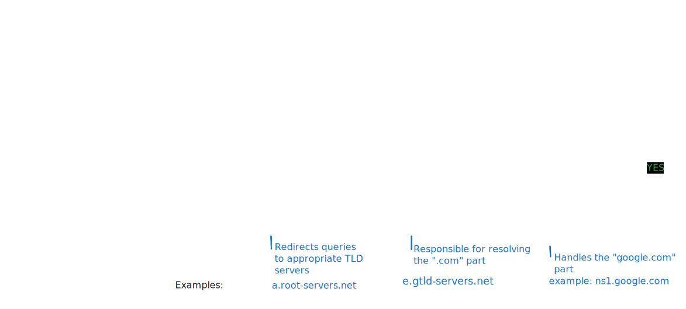

# DNS & Subdomains

## How do browsers get us to the correct server?



The hosts file is a straightforward text file that maps hostnames to IP addresses, offering a manual approach to domain name resolution that bypasses the DNS system. While DNS automates the process of translating domain names into IP addresses, the hosts file enables direct, local overrides. This functionality is especially useful for development, troubleshooting, or blocking websites.

On Windows, the hosts file can be found at **C:\Windows\System32\drivers\etc\hosts**, while on Linux and macOS, it is located at **/etc/hosts**. Each line in the file adheres to the following format:

```
127.0.0.1       localhost
192.168.1.10    devserver.local
```

we can add entries to allow/block unwanted websites:

```
0.0.0.0       unwanted-site.com # Non existent IP address.
127.0.0.1       myapp.local
```

### Key Concepts

### DNS Zone

In DNS, a zone is specific part of the domain namespace that administrators manage. It's some sort of virtual container where we find information about the domain and all of its subdomains.\
We find DNS zones in the zone file: a text file residing on a DNS server where we define resources records and crucial information about the domain names and IPs associated.

```dns-zone-file
$TTL 3600 ; Default Time-To-Live (1 hour)
@       IN SOA   ns1.example.com. admin.example.com. (
                2024060401 ; Serial number (YYYYMMDDNN)
                3600       ; Refresh interval
                900        ; Retry interval
                604800     ; Expire time
                86400 )    ; Minimum TTL

@       IN NS    ns1.example.com. # authoritative name servers (NS records)
@       IN NS    ns2.example.com. # authoritative name servers (NS records)
@       IN MX 10 mail.example.com. # mail server (MX record)
www     IN A     192.0.2.1 # IP addresses (A records)
mail    IN A     198.51.100.1
ftp     IN CNAME www.example.com.
```

### DNS Records Types

| Record Type | Full Name                 | Description                                                                                                                                 | Zone File Example                                                                              |
| ----------- | ------------------------- | ------------------------------------------------------------------------------------------------------------------------------------------- | ---------------------------------------------------------------------------------------------- |
| `A`         | Address Record            | Maps a hostname to its IPv4 address.                                                                                                        | `www.example.com.` IN A `192.0.2.1`                                                            |
| `AAAA`      | IPv6 Address Record       | Maps a hostname to its IPv6 address.                                                                                                        | `www.example.com.` IN AAAA `2001:db8:85a3::8a2e:370:7334`                                      |
| `CNAME`     | Canonical Name Record     | Creates an alias for a hostname, pointing it to another hostname.                                                                           | `blog.example.com.` IN CNAME `webserver.example.net.`                                          |
| `MX`        | Mail Exchange Record      | Specifies the mail server(s) responsible for handling email for the domain.                                                                 | `example.com.` IN MX 10 `mail.example.com.`                                                    |
| `NS`        | Name Server Record        | Delegates a DNS zone to a specific authoritative name server.                                                                               | `example.com.` IN NS `ns1.example.com.`                                                        |
| `TXT`       | Text Record               | Stores arbitrary text information, often used for domain verification or security policies.                                                 | `example.com.` IN TXT `"v=spf1 mx -all"` (SPF record)                                          |
| `SOA`       | Start of Authority Record | Specifies administrative information about a DNS zone, including the primary name server, responsible person's email, and other parameters. | `example.com.` IN SOA `ns1.example.com. admin.example.com. 2024060301 10800 3600 604800 86400` |
| `SRV`       | Service Record            | Defines the hostname and port number for specific services.                                                                                 | `_sip._udp.example.com.` IN SRV 10 5 5060 `sipserver.example.com.`                             |
| `PTR`       | Pointer Record            | Used for reverse DNS lookups, mapping an IP address to a hostname.                                                                          | `1.2.0.192.in-addr.arpa.` IN PTR `www.example.com.`                                            |

> The "`IN`" in the examples stands for "Internet." It's a class field in DNS records that specifies the protocol family. In most cases, you'll see "`IN`" used, as it denotes the Internet protocol suite (IP) used for most domain names. Other class values exist (e.g., `CH` for Chaosnet, `HS` for Hesiod) but are rarely used in modern DNS configurations.
