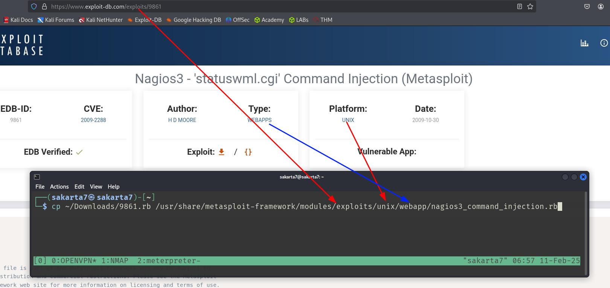

# Digging DNS

## Tools

| Tool           | Key Features                                                                                            | Use Cases                                                                                                          |
| -------------- | ------------------------------------------------------------------------------------------------------- | ------------------------------------------------------------------------------------------------------------------ |
| `dig`          | Versatile DNS lookup tool that supports various query types (A, MX, NS, TXT, etc.) and detailed output. | Manual DNS queries, zone transfers (if allowed), troubleshooting DNS issues, and in-depth analysis of DNS records. |
| `nslookup`     | Simpler DNS lookup tool, primarily for A, AAAA, and MX records.                                         | Basic DNS queries, quick checks of domain resolution and mail server records.                                      |
| `host`         | Streamlined DNS lookup tool with concise output.                                                        | Quick checks of A, AAAA, and MX records.                                                                           |
| `dnsenum`      | Automated DNS enumeration tool, dictionary attacks, brute-forcing, zone transfers (if allowed).         | Discovering subdomains and gathering DNS information efficiently.                                                  |
| `fierce`       | DNS reconnaissance and subdomain enumeration tool with recursive search and wildcard detection.         | User-friendly interface for DNS reconnaissance, identifying subdomains and potential targets.                      |
| `dnsrecon`     | Combines multiple DNS reconnaissance techniques and supports various output formats.                    | Comprehensive DNS enumeration, identifying subdomains, and gathering DNS records for further analysis.             |
| `theHarvester` | OSINT tool that gathers information from various sources, including DNS records (email addresses).      | Collecting email addresses, employee information, and other data associated with a domain from multiple sources.   |

## Dig

### Basics

```shell-session
$ dig google.com
```

<figure><figcaption></figcaption></figure>

```shell-session
$ dig +short hackthebox.com
# For only providing final information without all the text.
```

<figure><figcaption><p>+short option</p></figcaption></figure>

### Zone Transfer

<figure><figcaption><p>Zone Transfer Explained.</p></figcaption></figure>

```shell-session
$ dig axfr @server-requesting-the-information the-server
```


The information gleaned from an unauthorized zone transfer can be invaluable to an attacker. It reveals a comprehensive map of the target's DNS infrastructure, including : <mark style="color:red;">Subdomains, IP Addresses, Name Server Records.</mark>


## dnsenum

```shell-session
$ dnsenum --enum domain -f /usr/share/seclists/Discovery/DNS/subdomains-top1million-110000.txt -r
```
